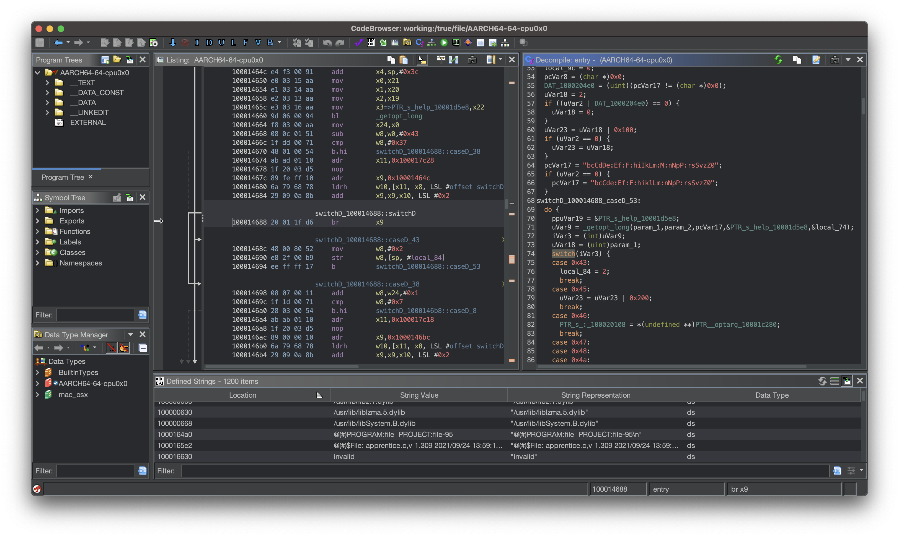
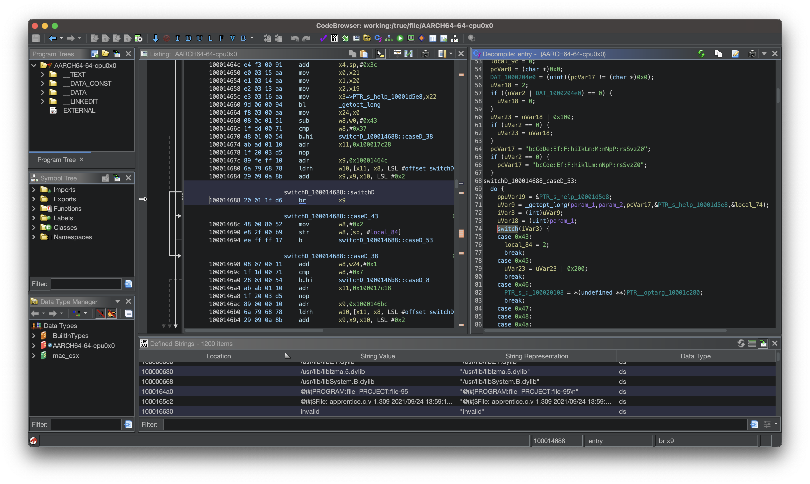

# ghidra-dark-theme

ghidra-dark-theme is a theme for Ghidra based on my original [ghidra-dark](https://github.com/zackelia/ghidra-dark) project. With the release of Ghidra 10.3 comes a new themeing feature. While Ghidra now ships with a proper dark theme (with some inspiration from ghidra-dark), this theme provides a similar look to ghidra-dark giving an easy-on-the-eyes dark theme.

To install, in the main Ghidra window: `Edit -> Theme -> Import`.

## ghidra-dark Theme

## Built-in Flat Dark Theme

